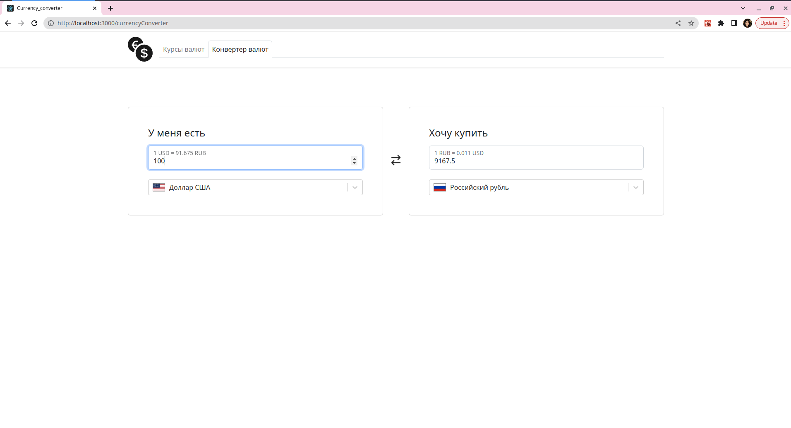

# React-currency-converter and exchange-rate

Simple currency app, which uses [Exchange Rates Data API](https://apilayer.com/marketplace/exchangerates_data-api) to get exchanging rates data for more than 170 world currencies.This API has several endpoints, where each of them serves a different purpose, use case. The endpoints include functionalities like receiving the latest exchange rates information for a specific set, or for all currencies; conversion from one to another currency.

## [currency-converter Live Demo](https://currency-converter-mri3.onrender.com)

## Additional info:
Used packages:

- [currency-flags](https://github.com/transferwise/currency-flags)
- [react-select](https://github.com/JedWatson/react-select)

## Setup
```sh
$ https://github.com/asenka0301/currency-converter.git
$ npm ci
$ npm run start:backend
$ npm run start:frontend
```

## UI example
### Currency rate

### Currency converter
